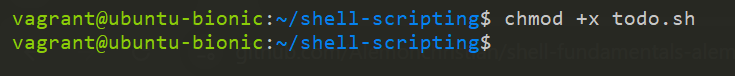
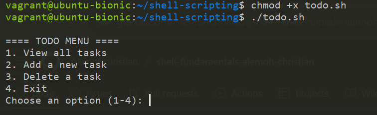
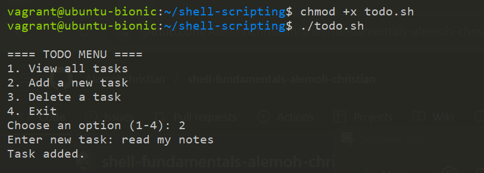
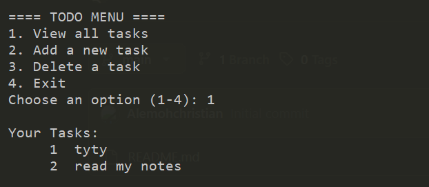
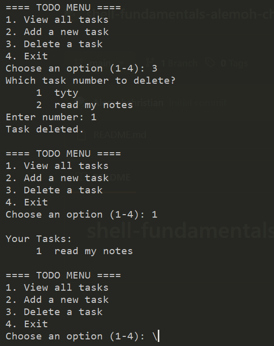

# shell-fundamentals-alemoh-christian

### 📸 Screenshot 1: Making the Script Executable

*I ran chmod +x todo.sh to make the script executable.*

---

### 📸 Screenshot 2: Running the Menu

*Shows the script displaying the menu options.*

---

### 📸 Screenshot 3: Adding a Task

*Demonstrates using option 2 to add a new task to the todo list.*

---

### 📸 Screenshot 4: Viewing Tasks

*Lists tasks using nl to show line numbers for easy reference.*

---

### 📸 Screenshot 5: Deleting a Task

*Deletes a task by entering its line number using sed -i.*

---

### ✅ How It Works

- The menu is displayed in a while true loop to keep the program running.
- Tasks are stored in ~/todo.txt so they persist between runs.
- Tasks are numbered using nl so they can be deleted by number.
- New tasks are added using echo with >>.
- Tasks are deleted by line number using sed -i.

---
